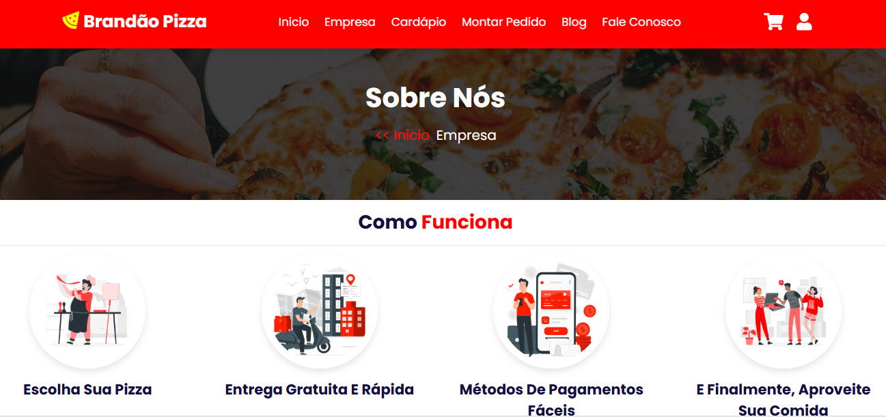
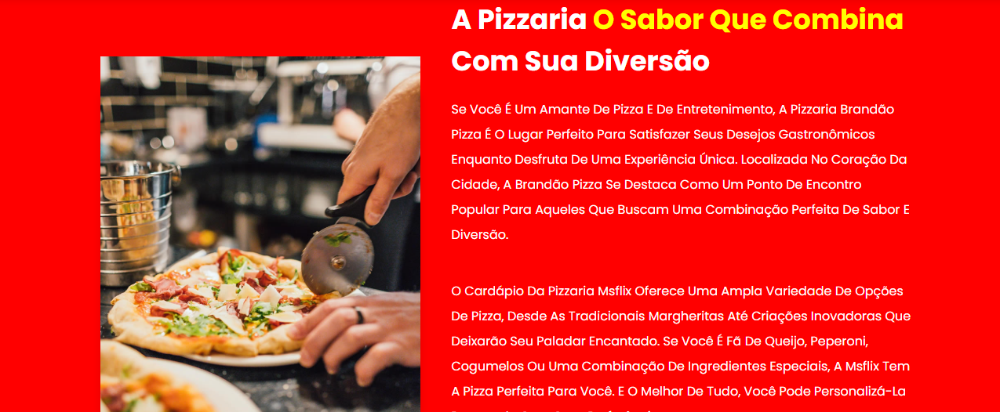
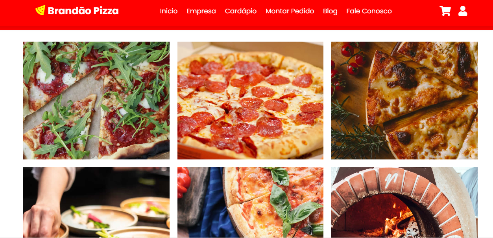
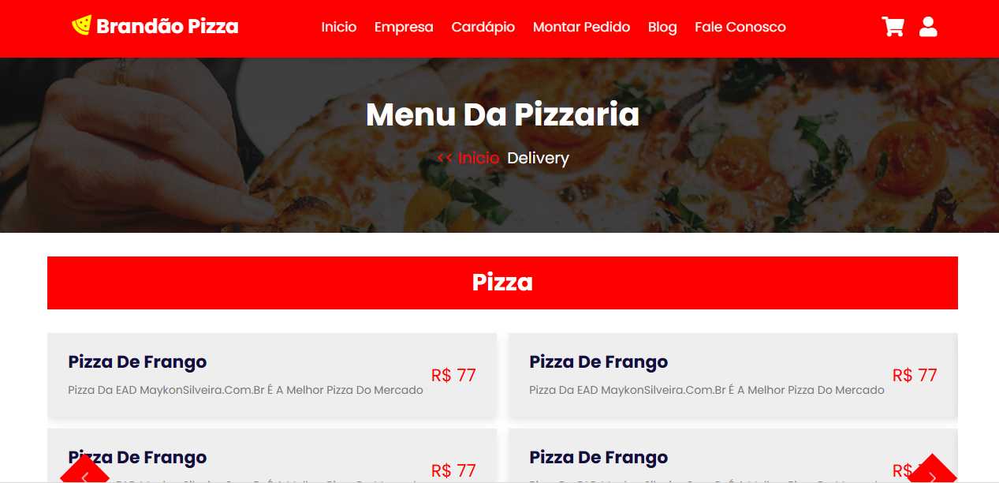
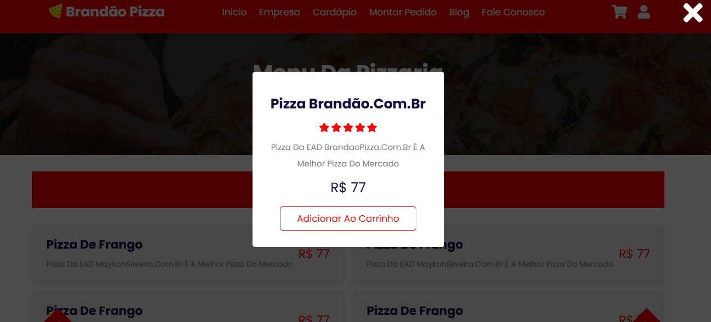
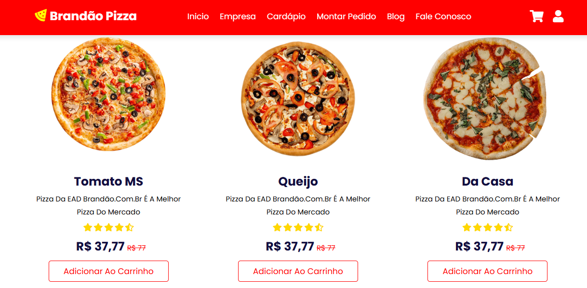
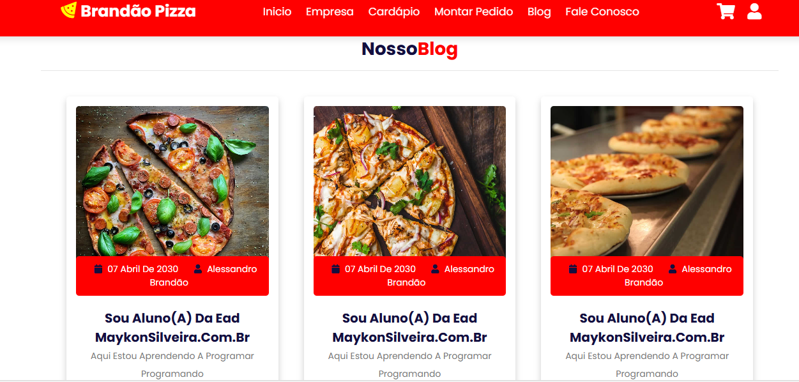
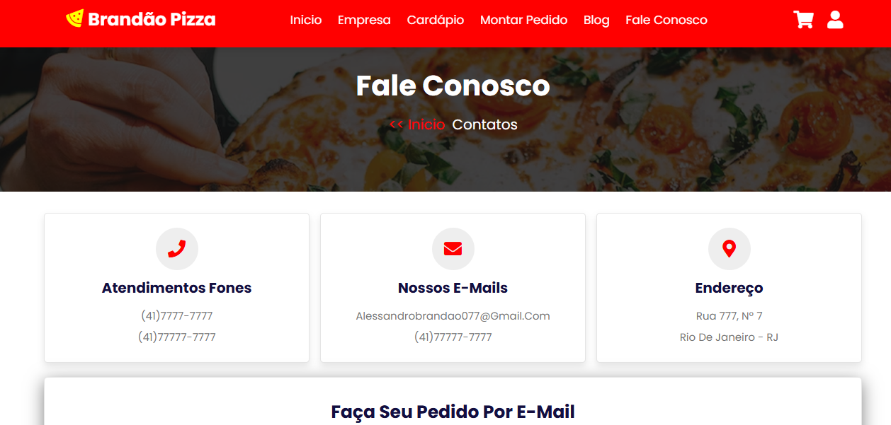

# Brandão Pizza

Este é um projeto de um site para uma pizzaria, construído com HTML, CSS e JavaScript. Ele apresenta uma estrutura completa, incluindo um menu de navegação, destaque de produtos, carrossel de slides e informações de contato.

# Seção "Sobre Nós" e "Como Funciona"

Este trecho de código representa uma parte importante do site, dedicada a apresentar a Brandão Pizza e explicar como a pizzaria funciona para os clientes. A página é dividida em seções que contam a história da empresa e mostram o processo de pedido

## O Que a Página Faz

### 1 - Banner de Entrada

No topo, há um banner com o título "Sobre Nós", que funciona como um cartão de boas-vindas. Logo abaixo, há um caminho simples que mostra ao cliente onde ele está no site, facilitando a navegação de volta para o início.

### 2 - Seção "Como Funciona"

Esta é uma área visual e direta, projetada para mostrar, passo a passo, como o cliente pode fazer seu pedido.

- Título: Um título chamativo "Como Funciona" para destacar o propósito da seção.

 - Passos: Quatro caixas, cada uma com uma imagem animada (GIF) e um texto simples para guiar o cliente:

- Escolha Sua Pizza: O primeiro passo para iniciar o pedido.

- Entrega Gratuita e Rápida: Promove a conveniência e agilidade do serviço.

 - Métodos de Pagamentos Fáceis: Destaca a flexibilidade de pagamento.

 - E Finalmente, Aproveite Sua Comida: O último passo, focado na satisfação do cliente.

### Seção "Sobre a Empresa" 

Esta seção é o coração da página, onde a marca se conecta com o cliente contando sua história.

- Imagem: Uma foto grande que representa a pizzaria e seu ambiente.

- Título: Um slogan criativo como "O Sabor Que Combina Com Sua Diversão" para reforçar a identidade da marca.

- Texto Descritivo: Parágrafos que contam a história da pizzaria, explicando seu conceito, a variedade do cardápio e a experiência única que ela oferece.

- Botão: Um botão "Saiba Mais" para encorajar o cliente a explorar mais sobre a empresa.

##  Galeria de Fotos 

Para complementar a experiência, há uma galeria de imagens que mostra o ambiente, as pizzas ou outros momentos da pizzaria. Ao clicar em uma das fotos, o cliente pode ver a imagem em um tamanho maior, o que ajuda a despertar o interesse e a confiança.

# Cardápio 

Este trecho de código é a seção de Cardápio do site. Ele foi desenvolvido para que os clientes possam navegar facilmente pelos diferentes tipos de produtos, como pizzas, lanches e bebidas, de uma forma organizada e moderna.

## O Que a Página Faz

A página é dividida em duas partes principais: uma para navegação e outra para visualização de detalhes dos produtos.

### 1 - Banner de Entrada

No topo, há um banner com o título "Menu da Pizzaria" e um caminho de volta para a página inicial, facilitando a navegação.

### 2 - Cardápio Interativo

A parte principal do código é um slider (uma espécie de carrossel) que permite ao cliente deslizar para ver as diferentes categorias do menu.

- Categorias: Cada "slide" do carrossel representa uma categoria diferente, como "Pizza", "Lanches" e "Bebidas"

- Itens do Menu: Dentro de cada categoria, os produtos são listados de forma clara, mostrando o nome do item, uma descrição e o preço.

- Navegação: O cliente pode usar os botões de "próximo" e "anterior" para passar de uma categoria para a outra. Há também uma paginação (os pontinhos) que indica em qual categoria ele está.

### 3. Janela de Detalhes do Produto (Modal)

Há uma área extra que funciona como uma janela pop-up, é ativada quando o cliente clica em um item do cardápio.

- Título: O nome do produto, por exemplo, "Pizza brandão.com.br".

- Avaliação: A avaliação do produto por meio de estrelas.

- Descrição: Um texto com mais detalhes sobre o item.

- Preço: O valor do produto.

- Botão: Um botão "Adicionar ao carrinho" para que o cliente finalize a compra do item

Esta janela pop-up é uma maneira eficiente de mostrar mais informações sem precisar sair da página do cardápio.

Em resumo, este código cria um cardápio digital que é fácil de usar e que organiza os produtos em categorias, permitindo que o cliente encontre rapidamente o que deseja.

# Seção Montar Pedido

Esta parte do site exibe o cardápio de pizzas para que os clientes possam fazer seus pedidos. Ela foi projetada para ser simples e direta, mostrando cada pizza com suas informações principais para facilitar a escolha.

## Funcionalidades da Seção

O objetivo principal desta área é apresentar os produtos de uma forma clara. Cada item no cardápio tem a seguinte estrutura:

- Imagem do Produto: Uma foto da pizza para abrir o apetite do cliente.

- Nome da Pizza: O nome do sabor, como "Calabresa" ou "Frango".

- Descrição Rápida: Uma frase curta que destaca a qualidade da pizza.

- Avaliação do Cliente: Estrelas para mostrar a popularidade e a nota do produto.

- Preço: O preço atual da pizza, com um preço original riscado ao lado para indicar um desconto ou promoção.

- Botão de Ação: Um botão com o texto "Adicionar ao Carrinho" para que o cliente possa incluir a pizza no pedido.
  - O design é repetido para cada pizza do cardápio, garantindo uma experiência de compra consistente e fácil de entender.

# Seção de Blog - Conectando com a Marca

Este trecho de código foi criado para a seção de Blog do site. O objetivo é compartilhar notícias, histórias e conteúdos relevantes para os clientes, construindo um relacionamento mais próximo e mostrando a personalidade da marca.

## O Que a Seção Faz

Esta área apresenta uma lista de artigos ou publicações do blog de forma organizada. Cada item do blog é exibido como um "card" com as seguintes informações.

- Imagem de Destaque: Uma foto que ilustra o conteúdo do artigo, tornando a visualização mais atraente.

- Informações do Post: Logo abaixo da imagem, o cliente encontra detalhes importantes:

 - Data de Publicação: Para saber quando o artigo foi lançado.

 - Autor: O nome da pessoa que escreveu o post, neste caso, "Alessandro Brandão".

- Título do Artigo: Um título principal, como "Sou Aluno(A) Da Ead MaykonSilveira.Com.Br", que resume o tema.

- Pequena Descrição: Um parágrafo curto que dá um gostinho do que o cliente vai encontrar ao clicar no artigo.

- Botão "Saiba Mais": Um botão para levar o cliente para a página completa do artigo, onde ele pode ler o conteúdo na íntegra.

# Seção Fale Conosco

  

Esta parte do site é a página de contato, essencial para que os clientes possam se comunicar com a pizzaria. Ela reúne todas as formas de contato em um só lugar, de maneira organizada e fácil de usar.

### O Que a Página Faz

#### 1 - Banner de Entrada
No topo, há um banner com o título "Fale Conosco" e um caminho simples que mostra ao cliente onde ele está no site, facilitando a navegação de volta para o início.

#### 2 - Informações de Contato
Esta área apresenta as informações de contato da pizzaria de forma clara, usando ícones para facilitar a identificação:

- Telefones de Atendimento: Lista os números de telefone para contato direto.

- E-mails: Mostra os endereços de e-mail para que os clientes possam enviar mensagens.

- Endereço: Exibe o endereço completo da pizzaria, informando a rua, número e cidade.

## 3 - Formulário e Localização

Esta parte da página oferece duas ferramentas importantes para a interação com o cliente:

- Formulário de Pedido por E-mail: Um formulário simples para que os clientes possam enviar um pedido ou uma mensagem. Ele pede informações como nome, e-mail, telefone e o assunto da mensagem, além de um campo para digitar o texto.

- Mapa de Localização: Para ajudar os clientes a encontrar a pizzaria, há um mapa integrado do Google Maps que mostra a localização exata da loja.

Em resumo, esta página de "Fale Conosco" foi projetada para ser completa e útil, fornecendo todas as formas de contato e ferramentas necessárias para uma comunicação eficiente entre o cliente e a pizzaria.

